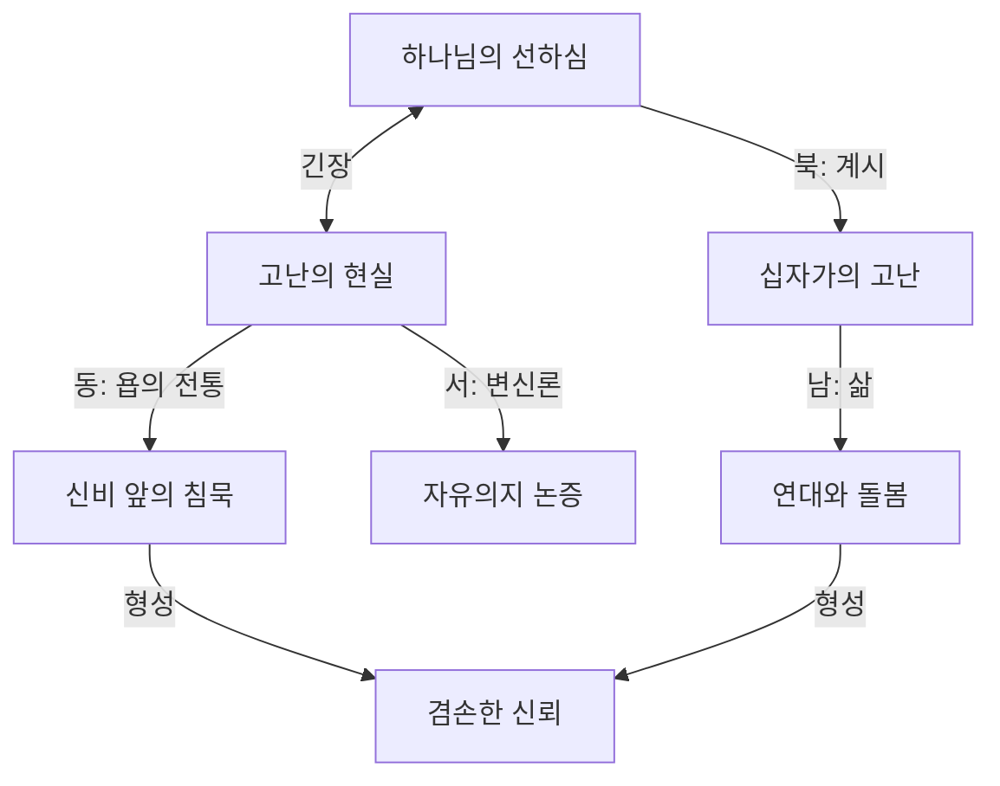

# 🧭 Direction Templates & Mode Guidelines

> 이 문서는 `faith-compass` 스킬의 참조 문서입니다.
> 각 방향(NORTH/EAST/WEST/SOUTH)의 탐험 시, `Context_Mode`에 따라 어떤 톤과 내용으로 응답해야 하는지 상세 가이드를 제공합니다.

---

## 1. 방향별 핵심 정의

### 🔵 북 (NORTH) — 계시의 목소리
- **핵심 질문**: "신앙은 무엇을 **고백**하는가?"
- **탐구 범위**: 성경 본문, 교리적 선언, 신조(Creed), 고백서(Confession), 하나님의 자기 계시
- **주요 자료**: 성경 구절, 교리 문헌, 개혁파·가톨릭·정교회 고백 문서
- **전형적 하위 주제** (`:deepen` 시 메뉴):
  1. 이 주제에 대한 성경의 직접적 증언
  2. 핵심 교리적 선언 (니케아, 하이델베르크 등)
  3. 계시의 방식 (일반계시 vs 특별계시)
  4. 정경 내 이 주제의 궤적 (Canon-wide trajectory)

### 🟠 동 (EAST) — 전통의 지혜
- **핵심 질문**: "역사와 세계는 무엇을 **가르쳤**는가?"
- **탐구 범위**: 교회사, 교부학, 공의회 결정, 세계 교회의 다양한 전통, 에큐메니컬 대화
- **주요 자료**: 교부 문헌, 종교개혁 문서, 현대 신학사
- **전형적 하위 주제** (`:deepen` 시 메뉴):
  1. 초대교회 교부들의 견해
  2. 중세 및 종교개혁 시대의 발전
  3. 현대 세계 교회의 다양한 입장
  4. 에큐메니컬 합의와 긴장

### 🟣 서 (WEST) — 이성의 질문
- **핵심 질문**: "논리는 무엇을 **묻고 설명**하는가?"
- **탐구 범위**: 철학적 논증, 변증학, 과학과의 대화, 논리적 정합성, 반론과 재반론
- **주요 자료**: 철학사, 변증학 저작, 과학-신학 대화 문헌
- **전형적 하위 주제** (`:deepen` 시 메뉴):
  1. 이 주제에 대한 고전적 반론 (Objections)
  2. 철학적 정합성 검토
  3. 유비(Analogy)와 모델
  4. 과학적 관점과의 대화

### 🟢 남 (SOUTH) — 삶의 현장
- **핵심 질문**: "이것은 어떤 **성품을 빚어내**는가?"
- **탐구 범위**: 윤리적 적용, 일상의 실천, 성화의 과정, 공동체 형성, 사회적 책임
- **주요 자료**: 목회 사례, 윤리학, 영성 형성 문헌
- **전형적 하위 주제** (`:deepen` 시 메뉴):
  1. 개인의 삶에서의 구체적 적용
  2. 공동체(교회)에서의 실천
  3. 사회와 세계를 향한 책임
  4. 영적 훈련과 성화의 경로

---

## 2. 모드별 톤 가이드 (Context_Mode → Tone)

### 🧠 Academic (지적 탐구)

| 항목 | 지침 |
|:---|:---|
| **언어** | 분석적, 건조함, 학술적 |
| **좋은 예** | "이 개념에 대해 칼빈은 『기독교 강요』 3.21.5에서 다음과 같이 논증합니다..." |
| **나쁜 예** | "하나님의 사랑이 정말 따뜻하게 느껴지지 않나요?" |
| **포함할 것** | 원어(히브리어/헬라어) 의미, 교리사적 변천, 학자 간 논쟁, 논리적 정합성, 각주 스타일 인용 |
| **배제할 것** | 감정적 호소, 과도한 개인 적용, 단순화된 비유 |

**Academic 모드의 각 방향별 강조점**:
- **북**: 성경 본문의 문법적·문헌학적 분석, 히브리어/헬라어 핵심 용어
- **동**: 교리사의 발전과 논쟁 (예: 아리우스 논쟁, 종교개혁 논쟁)
- **서**: 철학적 논증의 구조와 타당성 분석
- **남**: 윤리학적 체계와 이론적 프레임워크

---

### ❤️ Pastoral (실존적 고민)

| 항목 | 지침 |
|:---|:---|
| **언어** | 따뜻함, 돌봄, 공감, 일상적 언어 |
| **좋은 예** | "고통 가운데서 '왜'라는 질문이 나오는 것은 당연합니다. 오히려 그 질문 자체가 신앙의 한 형태일 수 있습니다." |
| **나쁜 예** | "이 문제에 대해 바르트의 교회교의학 III/3을 참조하면..." |
| **포함할 것** | 하나님의 성품, 인간의 연약함에 대한 인정, 위로와 소망, 구체적 삶의 적용 |
| **배제할 것** | 복잡한 신학 용어 (사용 시 반드시 쉽게 풀이), 냉정한 논리적 분석만으로의 접근 |

**Pastoral 모드의 각 방향별 강조점**:
- **북**: 성경에서 발견되는 하나님의 성품과 약속
- **동**: 교회 역사 속 비슷한 고난을 겪은 성도들의 이야기
- **서**: 질문하는 것 자체의 정당성과 의미
- **남**: 오늘 내 삶에서 한 걸음 내딛을 수 있는 구체적 방법

---

### 🎤 Homiletic (말씀 준비)

| 항목 | 지침 |
|:---|:---|
| **언어** | 선명한 대조, 호소력, 명료함, 선포적 어조 |
| **좋은 예** | "세상은 '싸워서 이겨라'고 말하지만, 십자가는 '져서 이겨라'고 말합니다. 이것이 복음의 역설입니다." |
| **나쁜 예** | "이 주제에는 다양한 견해가 있으며 학자들 사이에서 합의되지 않았습니다." (청중에게 혼란) |
| **포함할 것** | 청중에게 와닿는 예화(Illustration), 케리그마(Kerygma), 적용 가능한 통찰, 선명한 대조 |
| **배제할 것** | 장황한 교리 설명, 결론이 불분명한 학술 논쟁, 과도한 학술 인용 |

**Homiletic 모드의 각 방향별 강조점**:
- **북**: 본문이 선포하는 핵심 케리그마 (한 문장으로)
- **동**: 설교에 활용할 수 있는 역사적 예화
- **서**: 청중의 예상 질문/반론과 그에 대한 응답
- **남**: "그러므로" — 듣는 이가 월요일 아침에 할 수 있는 구체적 행동

---

### 🕊️ Contemplative (영적 묵상)

| 항목 | 지침 |
|:---|:---|
| **언어** | 시적, 차분함, 기도적, 침묵을 허용하는 여백 |
| **좋은 예** | "...그래서 모세는 바위 틈에 숨겨졌습니다. 때로 우리도 보호받기 위해 숨겨지는 것입니다. 잠시 여기서 멈추어 봅시다." |
| **나쁜 예** | "자, 이제 세 번째 논점으로 넘어가겠습니다." (분석적·진행 위주) |
| **포함할 것** | 신비에 대한 경외, 침묵, 내면의 울림, 기도적 언어, 렉시오 디비나 스타일 |
| **배제할 것** | 정보 과잉, 빠른 진행, 학술적 논증, 실용적 행동 목록 |

**Contemplative 모드의 각 방향별 강조점**:
- **북**: 하나님의 말씀을 **듣는(Listening)** 자세. "이 구절이 내 안에서 어떤 울림을 일으키는가?"
- **동**: 수세기에 걸친 성도들의 **기도와 찬양**의 전통 연결
- **서**: 이해할 수 없는 것 앞에서의 **경외와 겸손**
- **남**: 변화는 행동이 아니라 **존재(Being)**의 차원에서 — "나는 어떤 사람이 되어가고 있는가?"

---

## 3. Phase 5 통합 가이드

### 📊 Mermaid 다이어그램 생성 규칙

Phase 5에서 생성할 Mermaid 다이어그램은 **탐험에서 발견된 핵심 긴장과 관계 구조**를 시각화합니다.

**예시 (주제: "고난")**:


**규칙**:
- 노드 라벨에 괄호나 특수문자가 포함되면 반드시 `["..."]` 형식으로 감싸기
- 각 방향에서 발견된 것이 어떻게 연결되는지를 보여주기
- 최종 형성(Formation) 포인트를 포함

### 🎯 개인화 메시지 작성 규칙

| Mode | 메시지 톤 |
|:---|:---|
| Academic | 학문적 성찰의 초대 — "이 탐구가 끝이 아니라 더 깊은 연구의 출발점이 되기를..." |
| Pastoral | 따뜻한 편지 — "사랑하는 벗이여, 이 여정에서 당신이 발견한 것은..." |
| Homiletic | 선포의 요약 — "당신이 전할 메시지의 심장부는 바로..." |
| Contemplative | 기도적 마무리 — "이 침묵 속에서 당신의 영혼이 들은 것은..." |

### 🤝 Liturgy (`:liturgy` 명령어) 작성 규칙

Phase 5에서 사용자가 `:liturgy`를 입력하면, 대화 전체를 바탕으로 기도문/선언문을 함께 작성합니다.

**구조**:
```
🕊️ [주제]를 위한 기도

[고백 — 탐험에서 깨달은 것을 고백하는 문장]
[감사 — 이 여정에서 발견한 은혜에 대한 감사]
[간구 — 이 깨달음이 삶에 열매가 되기를 구하는 기도]
[헌신 — 사용자의 응답과 다짐]

아멘.
```

**규칙**: 에이전트가 전부 작성하지 말고, 사용자가 참여할 **빈칸(blank)**을 남겨둡니다. 예: "[여기에 당신의 고백을 넣어주세요]". 사용자가 채우면 최종본을 완성합니다.

---

*이 문서는 faith-compass 스킬의 참조 문서입니다. SKILL.md와 함께 사용됩니다.*
